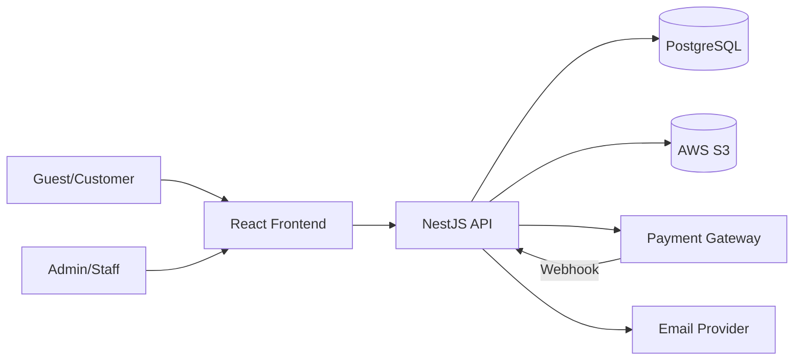
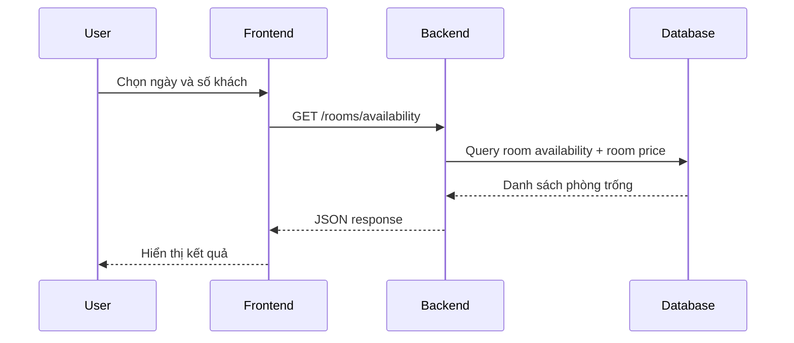
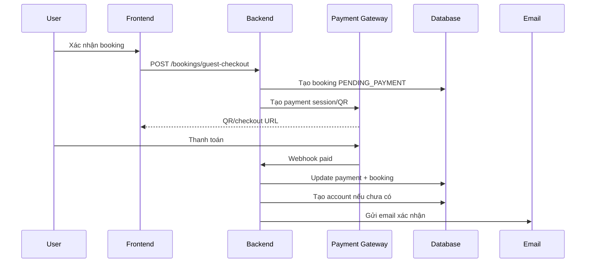

# 02 - System Architecture

## 1. Mục tiêu kiến trúc
- Triển khai production nhanh nhưng vẫn sạch.
- Dễ maintain cho team nhỏ.
- Tối ưu cho một homestay đơn cơ sở.
- Tách rõ các concern: UI, API, DB, storage, payment, email.

---

## 2. Kiến trúc tổng thể

### 2.1 Thành phần chính
1. **Frontend Web**
   - ReactJS
   - Material UI 6 + Emotion, MUI X Date Pickers + Day.js
   - Public website
   - Admin dashboard
2. **Backend API**
   - NestJS REST API
   - Auth, room, amenity, booking, payment, upload, analytics
3. **Database**
   - Khuyến nghị PostgreSQL
4. **Object Storage**
   - AWS S3
5. **Payment Provider**
   - Khuyến nghị PayOS
6. **Email Provider**
   - Resend hoặc SMTP
7. **Deployment**
   - Frontend: Vercel
   - Backend: Render
   - Database: managed Postgres

---

## 3. Sơ đồ kiến trúc logic



---

## 4. Kiến trúc ứng dụng đề xuất

### 4.1 Frontend modules
- `public-site`
  - home
  - availability-search
  - room-list
  - room-detail
  - checkout
  - auth
- `customer-portal`
  - profile
  - booking-history
- `admin-dashboard`
  - rooms
  - amenities
  - bookings
  - users
  - analytics

### 4.2 Backend modules
- `auth`
- `users`
- `rooms`
- `amenities`
- `availability`
- `bookings`
- `payments`
- `webhooks`
- `files`
- `emails`
- `analytics`
- `audit-logs`

### 4.3 Kiểu kiến trúc backend
Khuyến nghị **modular monolith**:
- đơn giản hơn microservices
- phù hợp scope hiện tại
- dễ chia module và refactor sau này

---

## 5. Luồng dữ liệu chính

### 5.1 Search availability


### 5.2 Booking and payment confirmation


---

## 6. Domain design

### 6.1 Aggregates chính
- `User`
- `Room`
- `Amenity`
- `Booking`
- `Payment`

### 6.2 Domain boundaries
- `Auth/User Domain`
  - login, register, forgot password, auto account creation
- `Room Catalog Domain`
  - room info, room price, images, amenities
- `Availability Domain`
  - kiểm tra phòng trống
- `Booking Domain`
  - tạo booking, snapshot giá, trạng thái booking
- `Payment Domain`
  - create payment, verify webhook, idempotency
- `Notification Domain`
  - email booking và email account

---

## 7. Dữ liệu và nhất quán
- Database là source of truth cho room, booking, user.
- Payment webhook là source of truth cho thanh toán thành công.
- Giá phòng được lấy trực tiếp từ room tại thời điểm tạo booking và lưu snapshot trong booking.
- Mọi webhook phải idempotent.

---

## 8. Kiến trúc UI/UX

### 8.1 Client UI principles
- đẹp, hiện đại, sang nhẹ
- có chất thơ Huế nhưng không cũ
- ưu tiên ảnh lớn, khoảng thở tốt, màu dịu
- CTA rõ để tối ưu conversion

### 8.2 Admin UI principles
- trung tính hơn client
- ưu tiên rõ dữ liệu
- thao tác tạo/sửa phòng nhanh

---

## 9. Bảo mật

### 9.1 Auth
- JWT access token + refresh token
- RBAC cho staff/admin
- hash password mạnh

### 9.2 Payment
- verify signature webhook
- không trust frontend cho payment status
- event log để chống xử lý lặp

### 9.3 Storage
- validate mime type, dung lượng
- quản lý object key tập trung
- có thể public read cho ảnh phòng hoặc đi qua CDN

### 9.4 API
- DTO validation
- rate limit cho auth, forgot password, webhook
- CORS chỉ cho frontend hợp lệ

---

## 10. Công nghệ khuyến nghị

| Layer | Khuyến nghị |
|---|---|
| Frontend | React + Vite + TailwindCSS |
| Backend | NestJS |
| ORM | Prisma |
| Database | PostgreSQL |
| Storage | AWS S3 |
| Payment | PayOS |
| Email | Resend |
| FE Deploy | Vercel |
| BE Deploy | Render |

---

## 11. Cấu trúc source code đề xuất

```text
frontend/
  src/
    app/
    pages/
    sections/
    components/
    layouts/
    lib/
    hooks/
    styles/

backend/
  src/
    modules/
      auth/
      users/
      rooms/
      amenities/
      availability/
      bookings/
      payments/
      files/
      emails/
      analytics/
    common/
    config/
    database/
```

---

## 12. Quyết định kiến trúc chính
1. **Guest checkout là flow mặc định quan trọng nhất.**
2. **Room price là giá cứng** do admin nhập trực tiếp trên từng phòng.
3. **Không dùng pricing rule engine** ở giai đoạn này.
4. **Không làm review module** ở MVP.
5. **S3 upload qua backend** để dễ kiểm soát.
6. **Modular monolith** để triển khai nhanh.
