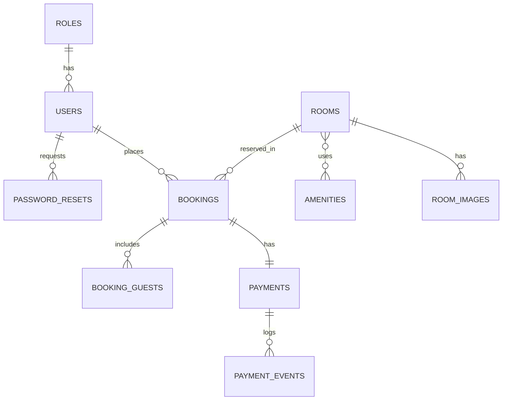

# 03 - Database Design

## 1. Database engine
**Khuyến nghị:** PostgreSQL.

Lý do:
- transaction tốt cho booking/payment
- query ngày giờ tốt
- constraint mạnh
- phù hợp khi cần chống double booking

---

## 2. Thực thể chính
- roles
- users
- rooms
- room_images
- amenities
- room_amenities
- bookings
- booking_guests
- payments
- payment_events
- password_resets
- audit_logs

---

## 3. ERD mức logic

---

## 4. Quy ước chung
- Primary key dùng UUID.
- Timestamps chuẩn:
  - `created_at`
  - `updated_at`
- Soft delete áp dụng cho `users`, `rooms` nếu cần.
- Enum có thể quản lý bằng application enum hoặc DB enum.

---

## 5. Bảng chi tiết

### 5.1 `roles`

| Column | Type | Constraints | Note |
|---|---|---|---|
| id | uuid | PK | |
| code | varchar(30) | unique, not null | CUSTOMER, STAFF, ADMIN |
| name | varchar(100) | not null | |
| created_at | timestamptz | not null | |
| updated_at | timestamptz | not null | |

### 5.2 `users`

| Column | Type | Constraints | Note |
|---|---|---|---|
| id | uuid | PK | |
| role_id | uuid | FK -> roles.id, not null | |
| full_name | varchar(150) | not null | |
| email | varchar(255) | unique nullable | |
| phone | varchar(20) | unique nullable | |
| password_hash | varchar(255) | not null | |
| status | varchar(30) | not null | ACTIVE, PENDING_ACTIVATION, SUSPENDED |
| must_change_password | boolean | default false | true khi auto-create |
| email_verified_at | timestamptz | nullable | |
| last_login_at | timestamptz | nullable | |
| created_by | uuid | nullable | |
| created_at | timestamptz | not null | |
| updated_at | timestamptz | not null | |
| deleted_at | timestamptz | nullable | |

**Business constraint**
- `email IS NOT NULL OR phone IS NOT NULL`

### 5.3 `rooms`

| Column | Type | Constraints | Note |
|---|---|---|---|
| id | uuid | PK | |
| slug | varchar(160) | unique, not null | |
| name | varchar(160) | not null | |
| room_type | varchar(50) | not null | SUITE, DELUXE, FAMILY... |
| short_description | varchar(300) | nullable | |
| description | text | not null | |
| price_per_night | numeric(12,2) | not null | giá cứng do admin nhập |
| max_guests | int | not null | |
| bedroom_count | int | default 1 | |
| bed_count | int | default 1 | |
| bathroom_count | int | default 1 | |
| size_sqm | numeric(8,2) | nullable | |
| status | varchar(30) | not null | ACTIVE, INACTIVE, MAINTENANCE |
| featured_order | int | nullable | |
| created_at | timestamptz | not null | |
| updated_at | timestamptz | not null | |
| deleted_at | timestamptz | nullable | |

### 5.4 `room_images`

| Column | Type | Constraints | Note |
|---|---|---|---|
| id | uuid | PK | |
| room_id | uuid | FK -> rooms.id, not null | |
| s3_key | varchar(500) | not null | |
| url | varchar(1000) | not null | |
| content_type | varchar(100) | nullable | image/jpeg, image/webp |
| size_bytes | bigint | nullable | |
| alt_text | varchar(255) | nullable | |
| sort_order | int | default 0 | |
| is_cover | boolean | default false | |
| created_at | timestamptz | not null | |

### 5.5 `amenities`

| Column | Type | Constraints | Note |
|---|---|---|---|
| id | uuid | PK | |
| code | varchar(50) | unique, not null | WIFI, AC, BREAKFAST |
| name | varchar(100) | not null | |
| icon | varchar(100) | nullable | |
| created_at | timestamptz | not null | |
| updated_at | timestamptz | not null | |

### 5.6 `room_amenities`

| Column | Type | Constraints | Note |
|---|---|---|---|
| room_id | uuid | PK, FK -> rooms.id | |
| amenity_id | uuid | PK, FK -> amenities.id | |

### 5.7 `bookings`

| Column | Type | Constraints | Note |
|---|---|---|---|
| id | uuid | PK | |
| booking_code | varchar(30) | unique, not null | |
| user_id | uuid | FK -> users.id, nullable | |
| room_id | uuid | FK -> rooms.id, not null | |
| booking_source | varchar(30) | not null default 'GUEST_CHECKOUT' | GUEST_CHECKOUT, CUSTOMER_ACCOUNT, ADMIN_CREATED |
| guest_name | varchar(150) | not null | snapshot |
| guest_email | varchar(255) | nullable | snapshot |
| guest_phone | varchar(20) | nullable | snapshot |
| check_in_date | date | not null | |
| check_out_date | date | not null | |
| guest_count | int | not null | |
| room_price_snapshot | numeric(12,2) | not null | giá mỗi đêm tại lúc đặt |
| total_amount | numeric(12,2) | not null | |
| status | varchar(30) | not null | PENDING_PAYMENT, CONFIRMED, CHECKED_IN, CHECKED_OUT, CANCELLED, REFUNDED |
| payment_status | varchar(30) | not null | PENDING, PAID, FAILED, EXPIRED, REFUNDED |
| hold_expires_at | timestamptz | nullable | |
| confirmed_at | timestamptz | nullable | |
| cancelled_at | timestamptz | nullable | |
| refunded_at | timestamptz | nullable | |
| note | text | nullable | |
| created_at | timestamptz | not null | |
| updated_at | timestamptz | not null | |

**Business constraint**
- `check_out_date > check_in_date`

### 5.8 `payments`

| Column | Type | Constraints | Note |
|---|---|---|---|
| id | uuid | PK | |
| booking_id | uuid | FK -> bookings.id, not null | một booking có thể mở rộng thành nhiều attempt về sau |
| provider | varchar(40) | not null | mặc định local là MOCKPAY |
| provider_order_id | varchar(100) | unique, not null | |
| provider_transaction_id | varchar(120) | nullable | |
| amount | numeric(12,2) | not null | |
| status | varchar(30) | not null | PENDING, PAID, FAILED, EXPIRED, REFUNDED |
| qr_code_url | varchar(1000) | nullable | |
| checkout_url | varchar(1000) | nullable | |
| expires_at | timestamptz | nullable | |
| paid_at | timestamptz | nullable | |
| failure_reason | varchar(300) | nullable | |
| provider_payload | text | nullable | JSON string |
| created_at | timestamptz | not null | |
| updated_at | timestamptz | not null | |

### 5.9 `payment_events`

| Column | Type | Constraints | Note |
|---|---|---|---|
| id | uuid | PK | |
| payment_id | uuid | FK -> payments.id, not null | |
| provider | varchar(40) | not null | |
| provider_event_id | varchar(120) | unique, not null | dùng cho idempotency |
| status | varchar(30) | not null | PAID, FAILED, EXPIRED |
| signature_hash | varchar(255) | nullable | |
| payload | text | not null | raw JSON string |
| processed_at | timestamptz | nullable | |
| created_at | timestamptz | not null | |

### 5.10 `email_logs`

| Column | Type | Constraints | Note |
|---|---|---|---|
| id | uuid | PK | |
| booking_id | uuid | FK -> bookings.id, nullable | |
| user_id | uuid | FK -> users.id, nullable | |
| email_type | varchar(60) | not null | BOOKING_CONFIRMATION, AUTO_ACCOUNT, RESET_PASSWORD |
| dedupe_key | varchar(150) | unique, not null | chống gửi mail trùng |
| recipient | varchar(255) | not null | |
| subject | varchar(255) | not null | |
| status | varchar(30) | not null | PENDING, SENT, FAILED |
| error_message | varchar(500) | nullable | |
| payload | text | nullable | JSON string |
| sent_at | timestamptz | nullable | |
| created_at | timestamptz | not null | |
| updated_at | timestamptz | not null | |

### 5.11 `password_reset_tokens`

| Column | Type | Constraints | Note |
|---|---|---|---|
| id | uuid | PK | |
| user_id | uuid | FK -> users.id, not null | |
| token | varchar(255) | unique, not null | |
| expires_at | varchar(40) | not null | ISO string |
| used_at | varchar(40) | nullable | ISO string |
| used_at | timestamptz | nullable | |
| created_at | timestamptz | not null | |

### 5.12 `audit_logs`

| Column | Type | Constraints | Note |
|---|---|---|---|
| id | uuid | PK | |
| actor_user_id | uuid | FK -> users.id, nullable | |
| action | varchar(100) | not null | CREATE_ROOM, UPDATE_ROOM_PRICE |
| entity_type | varchar(50) | not null | |
| entity_id | uuid | nullable | |
| before_data | jsonb | nullable | |
| after_data | jsonb | nullable | |
| ip_address | varchar(64) | nullable | |
| created_at | timestamptz | not null | |

---

## 6. Chỉ mục đề xuất

### 6.1 `users`
- unique index on `email`
- unique index on `phone`
- index on `role_id`
- index on `status`

### 6.2 `rooms`
- unique index on `slug`
- index on `room_type`
- index on `status`
- index on `featured_order`

### 6.3 `bookings`
- unique index on `booking_code`
- index on `(room_id, check_in_date, check_out_date)`
- index on `(user_id, created_at desc)`
- index on `booking_source`
- index on `status`
- index on `payment_status`
- index on `hold_expires_at`

### 6.4 `payments`
- unique index on `provider_order_id`
- unique index on `provider_transaction_id`
- index on `status`
- index on `booking_id`

### 6.5 `payment_events`
- index on `payment_id`
- unique index on `(provider_event_id)` nếu provider hỗ trợ event id ổn định

---

## 7. Chiến lược chống double booking
1. Mở transaction khi tạo booking.
2. Kiểm tra các booking active trùng khoảng ngày.
3. Nếu có, trả conflict.
4. Nếu không, tạo booking `PENDING_PAYMENT`.
5. Giữ phòng bằng `hold_expires_at`.

---

## 8. Trạng thái chính

### Booking status
- `PENDING_PAYMENT`
- `CONFIRMED`
- `CHECKED_IN`
- `CHECKED_OUT`
- `CANCELLED`
- `REFUNDED`

### Payment status
- `PENDING`
- `PAID`
- `FAILED`
- `EXPIRED`
- `REFUNDED`

### User status
- `ACTIVE`
- `PENDING_ACTIVATION`
- `SUSPENDED`

---

## 9. Snapshot bắt buộc trong booking
- guest_name
- guest_email
- guest_phone
- room_price_snapshot
- total_amount
- cancellation_policy_snapshot

---

## 10. Seed data tối thiểu
- roles: CUSTOMER, STAFF, ADMIN
- amenities phổ biến
- 1 admin user
- 3-5 phòng mẫu

---

## 11. Migration strategy
- Chỉ thay đổi schema qua migration.
- Không sửa tay trực tiếp trên production.
- Mỗi migration cần có rollback path hợp lý.
