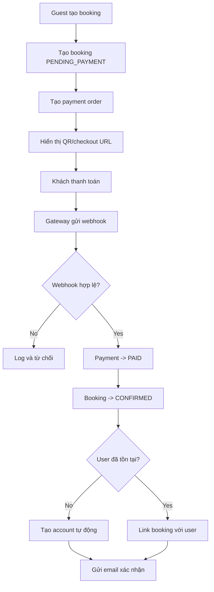

# 07 - Payment & Email Flow

## 1. Mục tiêu
- Khách thanh toán QR nhanh.
- Booking được xác nhận tự động qua webhook.
- Email xác nhận gửi ngay sau thanh toán thành công.
- Tự động tạo account cho khách mới.

---

## 2. Lựa chọn khuyến nghị

### Payment
**Production khuyến nghị:** PayOS  
**Local/dev hiện tại:** `MOCKPAY` nội bộ để test end-to-end FE/BE/DB khi chưa có credential thật

### Email
**Khuyến nghị:** Resend  
Alternative: Nodemailer + SMTP

---

## 3. Trạng thái tổng quát

### Booking
- `PENDING_PAYMENT`
- `CONFIRMED`
- `CANCELLED`
- `REFUNDED`

### Payment
- `PENDING`
- `PAID`
- `FAILED`
- `EXPIRED`
- `REFUNDED`

---

## 4. Luồng chuẩn

---

## 5. Chi tiết nghiệp vụ

### 5.1 Tạo booking tạm
- Backend kiểm tra availability.
- Lấy `price_per_night` hiện tại từ room.
- Tính:
  - `night_count`
  - `total_amount = price_per_night x night_count`
- Tạo booking `PENDING_PAYMENT`.
- Set `hold_expires_at = now + 15 phút`.

### 5.2 Tạo payment order
- amount = `total_amount`
- provider tạo QR/checkout URL
- payment status ban đầu = `PENDING`
- local/dev hiện trả về:
  - `checkoutUrl`
  - `qrCodeUrl`
  - `providerOrderId`
  - `paymentId`

### 5.3 Nhận webhook
Backend phải:
1. verify signature
2. tìm payment theo provider order id
3. kiểm tra amount
4. kiểm tra trạng thái hiện tại
5. xử lý idempotent
6. chống overbooking lần cuối trước khi confirm nếu payment tới muộn

### 5.4 Xác nhận booking
Nếu hợp lệ:
- payment -> `PAID`
- booking payment status -> `PAID`
- booking status -> `CONFIRMED`
- set `confirmed_at`

### 5.5 Tạo account tự động
Nếu chưa có user theo email/phone:
- tạo role `CUSTOMER`
- sinh password ngẫu nhiên mạnh
- set `must_change_password = true`
- sinh `password_reset_token`

### 5.6 Gửi email
- booking confirmation
- auto-created account email nếu là khách mới
- reset password email cho flow quên mật khẩu

---

## 6. Idempotency
- Mỗi webhook ghi vào `payment_events`.
- Nếu transaction hoặc event đã xử lý rồi thì return success nhưng không update lại.
- Tránh gửi email lặp bằng `email_logs.dedupe_key`.

---

## 7. Security rules
- Không trust return URL từ frontend.
- Chỉ webhook đã verify mới được chuyển `PAID`.
- So sánh:
  - order id
  - amount
  - signature

---

## 8. Email types

### 8.1 Booking confirmation
Gồm:
- tên khách
- booking code
- tên phòng
- check-in/check-out
- số khách
- giá mỗi đêm
- tổng tiền
- địa chỉ/hotline

### 8.2 Auto-created account
Gồm:
- thông báo đã tạo account
- email đăng nhập
- mật khẩu tạm hoặc link đặt mật khẩu
- yêu cầu đổi mật khẩu

### 8.3 Forgot password
- reset link hoặc OTP

---

## 9. Tình huống lỗi

| Tình huống | Hành vi hệ thống |
|---|---|
| Webhook đến chậm | Booking vẫn pending tạm thời, job reconcile có thể kiểm tra lại |
| Webhook lặp | Không double update |
| Email lỗi tạm thời | Retry qua queue/job |
| Hết hạn giữ phòng | Booking/payment chuyển expired hoặc cancelled theo rule |
| Late payment nhưng phòng đã bị giữ bởi booking khác | Payment bị fail/cancel để tránh overbooking, cần manual follow-up nếu là gateway thật |

---

## 10. Return URL vs Webhook URL

### Return URL
- phục vụ UX
- frontend gọi lại API để lấy trạng thái thật

### Webhook URL
- phục vụ nghiệp vụ
- cập nhật payment và booking
- trigger email

---

## 11. Service interfaces đề xuất

### PaymentProvider
- `createPayment()`
- `verifyWebhook()`
- `parseWebhook()`
- `refundPayment()`

### EmailService
- `sendBookingConfirmation()`
- `sendAutoAccountEmail()`
- `sendResetPasswordEmail()`

---

## 12. Trạng thái implementation hiện tại

Đã chạy thật trong code:

- `POST /bookings/guest-checkout`
- `GET /bookings/code/:bookingCode`
- `GET /payments/:bookingId/status`
- `POST /payments/webhooks/mockpay`
- `POST /payments/webhooks/payos`
- `POST /payments/mock/:paymentId/complete`
- `POST /auth/forgot-password` có tạo token + ghi email log

Provider strategy hiện tại:

- `PAYMENT_PROVIDER=MOCKPAY` -> local/dev end-to-end không cần cổng thanh toán thật
- `PAYMENT_PROVIDER=PAYOS` + `PAYOS_*` env -> dùng PayOS thật
- nếu `PAYOS_AUTO_CONFIRM_WEBHOOK=true`, backend sẽ thử confirm webhook URL với PayOS lúc boot

Schema liên quan đang dùng:

- `bookings`
- `payments`
- `payment_events`
- `email_logs`
- `password_reset_tokens`

## 13. Job nền đề xuất
- retry email lỗi
- reconcile booking/payment pending
- dọn booking hết hạn giữ phòng
