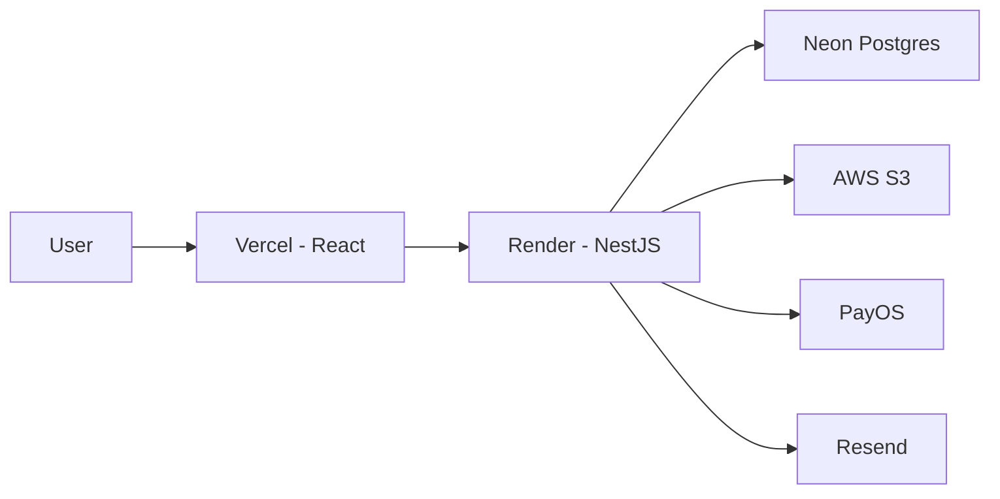

# 08 - Deployment Guide

## 1. Mục tiêu
Deploy production cho:
- Frontend React
- Backend NestJS
- PostgreSQL
- AWS S3
- Payment webhook
- Email provider

**Khuyến nghị giai đoạn 1**
- Frontend: Vercel
- Backend: Render
- Database: Neon Postgres
- Storage: AWS S3
- Email: Resend

---

## 2. Kiến trúc deploy



---

## 3. Domain đề xuất
- `www.yourhomestay.vn` cho frontend
- `api.yourhomestay.vn` cho backend

---

## 4. Environment variables

### Frontend
```env
VITE_API_BASE_URL=https://api.yourhomestay.vn/api/v1
VITE_PUBLIC_SITE_URL=https://www.yourhomestay.vn
```

### Backend
```env
NODE_ENV=production
PORT=3000
BACKEND_PUBLIC_URL=https://api.yourhomestay.vn/api/v1
FRONTEND_URL=https://www.yourhomestay.vn
DATABASE_URL=postgresql://...

JWT_ACCESS_SECRET=...
JWT_REFRESH_SECRET=...

AWS_REGION=ap-southeast-1
AWS_S3_BUCKET=hue-homestay-prod-assets
AWS_ACCESS_KEY_ID=...
AWS_SECRET_ACCESS_KEY=...
AWS_S3_PUBLIC_BASE_URL=https://hue-homestay-prod-assets.s3.ap-southeast-1.amazonaws.com
AWS_S3_PREFIX=rooms
AWS_S3_ENDPOINT=
AWS_S3_FORCE_PATH_STYLE=false

PAYMENT_PROVIDER=PAYOS
PAYMENT_WEBHOOK_URL=https://api.yourhomestay.vn/api/v1/payments/webhooks/payos
PAYOS_CLIENT_ID=...
PAYOS_API_KEY=...
PAYOS_CHECKSUM_KEY=...
PAYOS_PARTNER_CODE=
PAYOS_BASE_URL=
PAYOS_AUTO_CONFIRM_WEBHOOK=true
PAYMENT_RETURN_URL=https://www.yourhomestay.vn/payment/result
PAYMENT_CANCEL_URL=https://www.yourhomestay.vn/payment/cancel

RESEND_API_KEY=...
RESEND_BASE_URL=https://api.resend.com/emails
EMAIL_FROM=booking@yourhomestay.vn
SMTP_HOST=
SMTP_PORT=587
SMTP_SECURE=false
SMTP_USER=
SMTP_PASS=
```

---

## 5. Database từ zero

### Khuyến nghị: Neon Postgres
1. Tạo project Neon.
2. Copy `DATABASE_URL`.
3. Tạo database production.
4. Chạy migration từ backend.

---

## 6. Deploy backend lên Render

### Build command
```bash
npm install && npm run build
```

### Start command
```bash
npm run start:prod
```

### Yêu cầu
- set toàn bộ env backend
- có endpoint `/health`
- chạy migration trước hoặc trong pipeline deploy

---

## 7. Deploy frontend lên Vercel

### Build command
```bash
npm run build
```

### Output directory
```bash
dist
```

### Yêu cầu
- set env frontend
- kiểm tra domain production gọi đúng API domain

---

## 8. DNS và SSL
- trỏ `www` về Vercel
- trỏ `api` về Render
- bật HTTPS mặc định

---

## 9. CORS
Chỉ cho phép:
- `https://www.yourhomestay.vn`
- `http://localhost:5173`

---

## 10. Cấu hình production cần test
- upload ảnh S3
- search availability
- guest booking
- payment sandbox / payment live
- webhook
- email confirmation
- forgot password email

---

## 11. Quality gate bắt buộc

Không được merge hoặc deploy nếu còn **bất kỳ lỗi TypeScript hoặc lint** nào ở frontend hay backend.

### Frontend
```bash
npm run build
npm run lint
```

### Backend
```bash
npm run build
npm run lint
npm run test:e2e
```

### Rule áp dụng
- build phải pass hoàn toàn, không còn TypeScript error
- lint phải pass hoàn toàn, không còn warning/error cần xử lý thủ công
- với backend, e2e tối thiểu phải pass trước khi deploy production
- chỉ đổi env là chạy được không đủ điều kiện go-live; vẫn phải pass đủ quality gate ở trên

---

## 12. Checklist go-live

### Hạ tầng
- Domain và SSL hoạt động
- Database backup bật
- Env variables đủ
- S3 upload hoạt động

### Nghiệp vụ
- Tạo/sửa phòng được
- Chỉnh giá cứng phòng được
- Gắn tiện nghi nổi bật được
- Booking guest thành công
- Webhook cập nhật chuẩn
- Email xác nhận gửi được

### Bảo mật
- Secrets không lộ
- JWT secret mạnh
- CORS đúng domain
- S3 policy đúng

---

## 13. Monitoring
- Uptime monitor cho `/health`
- Sentry cho frontend/backend
- Theo dõi webhook errors
- Theo dõi mail failures

---

## 14. Lộ trình nâng cấp
- Thêm CDN cho ảnh
- Thêm Redis cache
- Thêm queue worker cho email/payment jobs
- Nếu traffic tăng, chuyển backend sang hạ tầng AWS riêng
